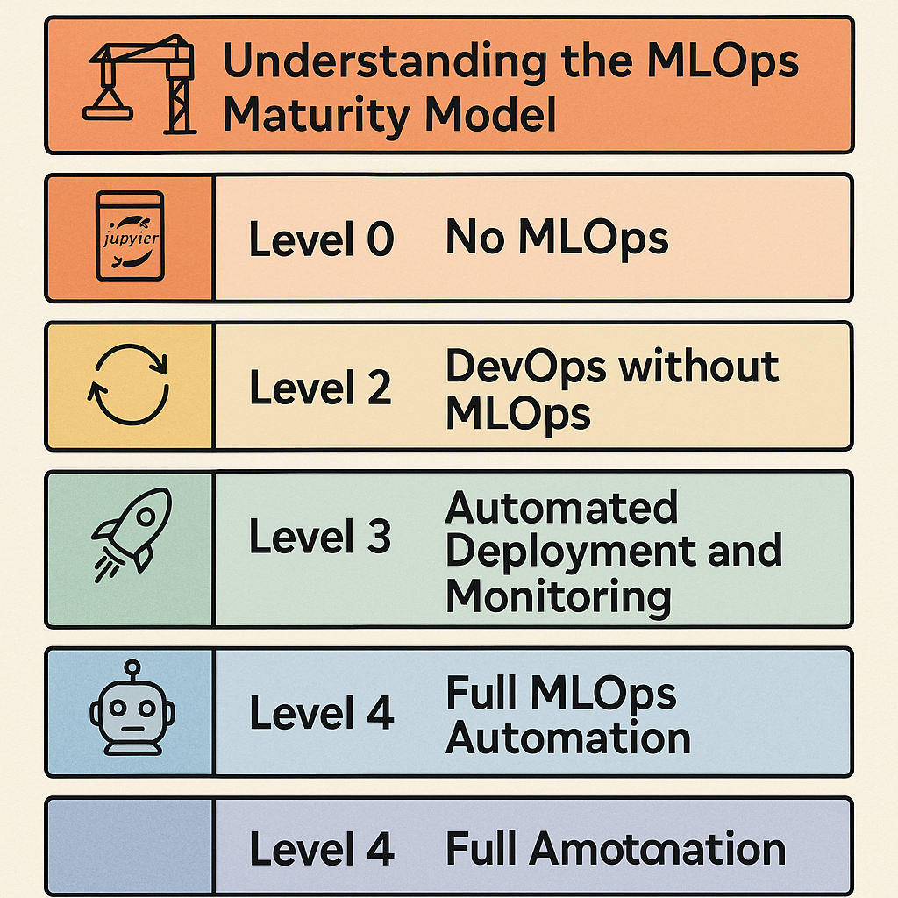

# MLOps Zoomcamp 1.1 - Introduction
YouTube Link: https://www.youtube.com/watch?v=s0uaFZSzwfI&list=PL3MmuxUbc_hIUISrluw_A7wDSmfOhErJK&index=2

## Summary

- 📌 **What is MLOps?**  
  MLOps refers to best practices for deploying machine learning into production. It ensures reproducibility, scalability, and collaboration.

- 🚕 **Course Example**  
  The course uses the scenario of predicting taxi ride duration to explore ML lifecycle stages.

- 🔄 **Three Project Stages**  
  ML projects are simplified into:
  - Design – Decide if ML is needed
  - Train – Build and evaluate models
  - Operate – Deploy and monitor models

- 🔧 **MLOps Practices Help**  
  MLOps supports the entire lifecycle—training, deployment, and monitoring—via automation and teamwork.

## Insights Based on Numbers

- 🔢 **3 Core Stages**: Design, Train, Operate
- 🧠 **1 Use Case**: Predicting taxi ride duration
- 🔄 **1-Click Retraining**: Emphasizes automation of retraining workflows

## Example Exploratory Questions

- What are the three simplified stages of an ML project lifecycle?
- How does the taxi example illustrate the purpose of MLOps?
- What challenges does MLOps aim to solve during model deployment and monitoring?

# MLOps Zoomcamp 1.5 - MLOps Maturity Model
YouTube Link: https://www.youtube.com/watch?v=XwTH8BDGzYk&list=PL3MmuxUbc_hIUISrluw_A7wDSmfOhErJK&index=8

## Summary

- 🏗️ **Understanding the MLOps Maturity Model**  
  The maturity model is a structured framework, adapted from a Microsoft article, that helps organizations evaluate and improve their machine learning production processes. It ranges from level 0 (no MLOps) to level 4 (full automation), with each level representing increasing sophistication and reliability.

- 🛠️ **Level 0: No MLOps**  
  Machine learning work is carried out in standalone Jupyter notebooks with no automation, no experiment tracking, and no metadata management. This level may suffice for personal projects or proof-of-concepts (POCs), but it lacks the infrastructure needed for scaling or productionization.

- 🚧 **Level 1: DevOps without MLOps**  
  At this level, general DevOps practices such as CI/CD pipelines, unit tests, integration tests, and automated deployments are implemented. These practices originate from traditional software engineering and are ML-agnostic. Although these tools improve release processes, model reproducibility and ML-specific metrics are often missing.

- 🔄 **Level 2: Automated Training Pipelines**  
  Machine learning training is automated using scripts or basic pipelines, eliminating the need to rerun notebooks manually. Tools like experiment trackers and model registries are introduced. While deployment remains manual or semi-automated, it is structured and relatively easy. Data scientists start working more closely with engineers.

- 🚀 **Level 3: Automated Deployment and Monitoring**  
  Models trained at level 2 are now deployed automatically, often via APIs on ML platforms. A/B testing becomes feasible, allowing performance comparison between model versions in production. Basic model monitoring is also implemented, although there's ambiguity about whether monitoring belongs here or in level 4.

- 🤖 **Level 4: Full MLOps Automation**  
  The entire ML lifecycle is automated:
  - Performance drifts are detected automatically,
  - Retraining is triggered without human input,
  - New models are evaluated and deployed based on pre-configured logic (including A/B test results),
  - The system maintains itself without intervention.
  
  This is ideal for large-scale applications with multiple mission-critical models.

- 🧭 **Practical Adoption Strategy**  
  It's emphasized that not every project needs level 4 automation. A pragmatic approach is recommended:
  - For early-stage or single-use models, level 0 or 1 may suffice.
  - As projects mature and models scale, moving to levels 2 and 3 ensures stability and traceability.
  - Only models that are high-impact or frequently updated may need level 4 infrastructure.

- 📦 **Course Coverage**  
  While the course may not demonstrate full level 4 automation, it aims to provide hands-on tools and techniques up to level 3, including model tracking, basic deployment, and monitoring.