# MLOps Zoomcamp 2.1 - Introduction to Experiment Tracking
YouTube Link: [MLOps Zoomcamp 2.1 - Introduction to Experiment Tracking](https://www.youtube.com/watch?v=MiA7LQin9c8&list=PL3MmuxUbc_hIUISrluw_A7wDSmfOhErJK)

## Summary
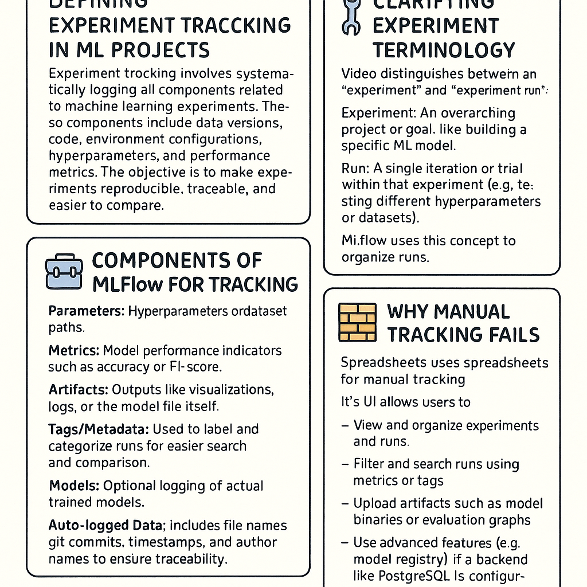

- 🧪 **Defining Experiment Tracking in ML Projects**  
  Experiment tracking involves systematically logging all components related to machine learning experiments. These components include data versions, code, environment configurations, hyperparameters, and performance metrics. The objective is to make experiments reproducible, traceable, and easier to compare.

- 🛠️ **Clarifying Experiment Terminology** 
  The video distinguishes between an "experiment" and an "experiment run":
  - Experiment: An overarching project or goal, like building a specific ML model.
  - Run: A single iteration or trial within that experiment (e.g., testing different hyperparameters or datasets).
  - MLflow uses this concept to structure tracking into a hierarchy of experiments and runs.

- 🧰 **Components of MLflow for Tracking**  
  MLflow offers a tracking module that helps capture:
  - Parameters: Hyperparameters or dataset paths.
  - Metrics: Model performance indicators such as accuracy or F1-score.
  - Artifacts: Outputs like visualizations, logs, or the model file itself.
  - Tags/Metadata: Used to label and categorize runs for easier search and comparison.
  - Models: Optional logging of actual trained models.
  - Auto-logged Data: Includes file names, git commits, timestamps, and author names to ensure traceability.

- 🧱 **Why Manual Tracking Fails**  
  Manual experiment tracking using spreadsheets is common but highly flawed. The speaker illustrates problems such as:
  - No standardized format for metrics or descriptions,
  - Manual input errors,
  - Lack of clarity for collaborators or future revisits,
  - Poor scalability for large or collaborative projects.

- 🚀 **How MLflow Simplifies Tracking**  
  MLflow is presented as a simple Python package installable via pip. Its UI allows users to:
  - View and organize experiments and runs,
  - Filter and search runs using metrics or tags,
  - Upload artifacts such as model binaries or evaluation graphs,
  - Use advanced features (e.g., model registry) if a backend like PostgreSQL is configured.

- 🌐 **Demonstration of MLflow UI**  
  The instructor shows how to:
  - Launch the MLflow UI locally using mlflow ui,
  - Create new experiments and assign artifact storage locations,
  - Navigate experiment runs, apply filters, and explore model performance visually,
  - Understand UI limitations when no backend database is set up (e.g., model registry errors).

- 🧑‍💻 **Real-World Implications**  
  Whether you're competing in Kaggle or working in a corporate team, tracking ensures you can:
  - Reproduce results weeks or months later,
  - Optimize models through careful iteration,
  - Collaborate effectively by making your experiments accessible and understandable.

- 📈 **Conclusion and Preview**  
  The session ends with a look ahead to the next module, where the instructor will demonstrate how to integrate MLflow into a Jupyter Notebook environment for hands-on tracking.


List of commands:
```bash
mlflow ui --backend-store-uri sqlite:///mlflow.db
```

# MLOps Zoomcamp 2.4 - Model Management
YouTube Link: [MLOps Zoomcamp 2.4 - Model Management](https://www.youtube.com/watch?v=OVUPIX88q88&list=PL3MmuxUbc_hIUISrluw_A7wDSmfOhErJK&index=11)

Additional Sources: [Neptune AI](https://neptune.ai/blog/ml-experiment-tracking)

## Summary
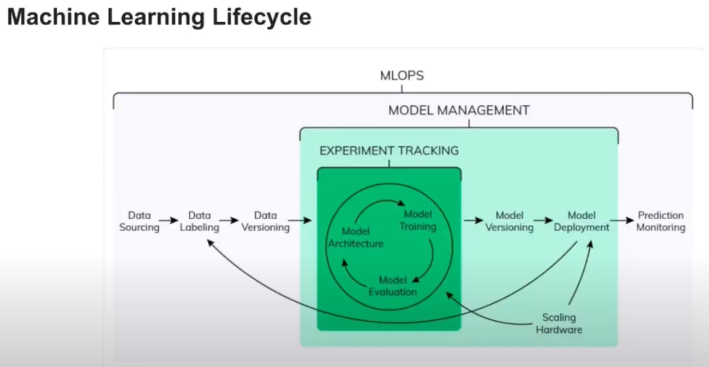

- 🧠 **Introduction to Model Management**  
  Model management is an advanced MLOps function that includes not only experiment tracking but also versioning, deployment, and model scalability. It ensures that once a machine learning model is trained and validated, it is stored, managed, and used in a reliable, reproducible way.
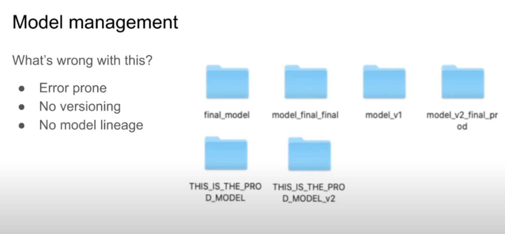

- 🧾 **Manual Versioning Challenges**  
  Storing models in folders manually leads to:
  - Risk of overwriting models,
  - Inconsistent naming and poor traceability,
  - No lineage, making it difficult to understand how a model was created or trained.

- 🧰 **Model Logging with MLflow**  
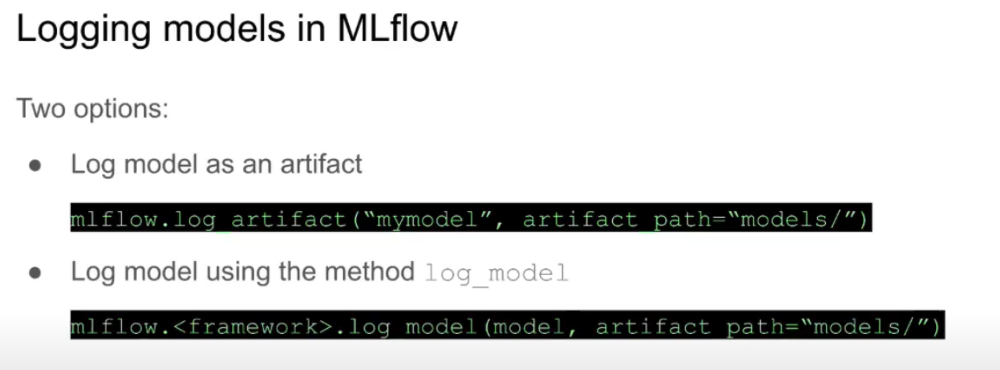
  MLflow provides two ways to log models:
  - mlflow.log_artifact(): Saves model files (e.g., Pickle) as static artifacts. This is simple but lacks structure.
  - mlflow.log_model(): Saves in MLflow's structured format, including metadata, environments, and multiple "flavors" for reuse.

- 🔄 **Tracking Model Training with MLflow**  
  A complete run involves:
  - Starting a run using mlflow.start_run(),
  - Logging parameters and metrics,
  - Saving the model with log_model() in a chosen format,
  - Optionally saving preprocessing artifacts (like a vectorizer) to ensure consistency for future inference.

- 📦 **What MLflow Stores**  
  Using log_model() generates:
  - MLmodel file: Specifies flavors and paths.
  - conda.yaml / requirements.txt: Captures environment dependencies.
  - Flavors: Allow the model to be loaded as a generic Python function or a native model object (e.g., XGBoost).

- ⚙️ **Adding Preprocessing Components**  
  Logging preprocessors like DictVectorizer is essential. This ensures that future inputs can be preprocessed the same way as during training, which is crucial for consistency and reliability in deployment.

- 🔍 **Making Predictions Using MLflow Models**  
  MLflow generates code snippets to load and predict using logged models:
  - With Spark using mlflow.pyfunc.spark_udf(),
  - With Pandas using mlflow.pyfunc.load_model(),
  - With native model APIs like mlflow.xgboost.load_model() for advanced access.

- 🧪 **Model Consistency and Validation**  
  Predictions from logged models match original predictions, validating that MLflow preserves model fidelity. This allows teams to use models confidently in production environments.

- 🌐 **Cross-Platform Deployment**  
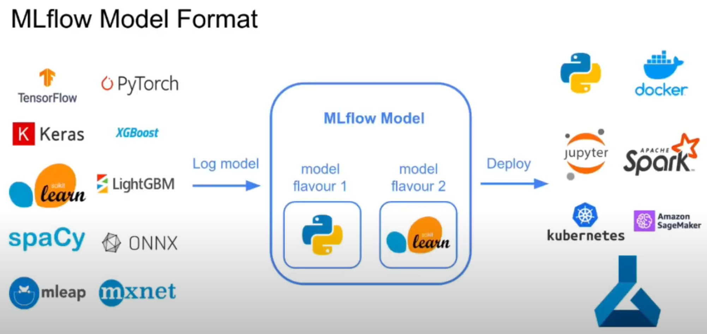
  MLflow supports:
  - Deployment in notebooks, Docker containers, Spark batch jobs,
  - Cloud environments such as AWS SageMaker and Azure ML,
  - Kubernetes clusters for scalable real-time inference.

- 🧾 **Conclusion**  
  Model management with MLflow brings structure and reproducibility to ML workflows. It replaces fragile manual folder structures with a robust system that supports tracking, inference, and deployment.

# MLOps Zoomcamp 2.5 - Model Registry
YouTube Link: [MLOps Zoomcamp 2.5 - Model Registry](https://www.youtube.com/watch?v=TKHU7HAvGH8&list=PL3MmuxUbc_hIUISrluw_A7wDSmfOhErJK&index=12)

## Summary
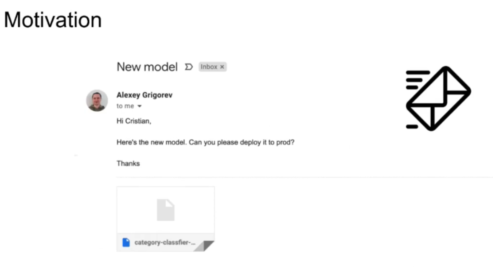
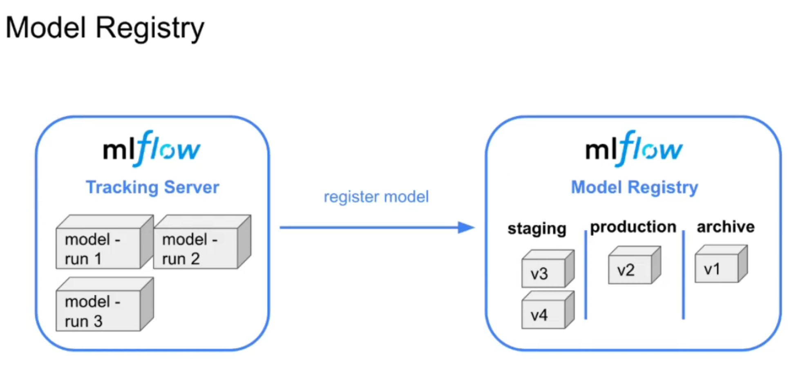

- 🧭 **Purpose of Model Registry**  
  A model registry is a centralized platform that facilitates the organized management of machine learning models, tracking their versions, metadata, and deployment stages. It eliminates the need for chaotic email exchanges and manual tracking between data scientists and engineers.

- 💼 **Scenario Illustration**  
  A common workflow problem is demonstrated: a data scientist builds a model and emails an engineer to deploy it. However, the engineer lacks information on changes, environment setup, and dependencies. The registry solves this by centralizing all model-related metadata and making transitions transparent.

- 🧪 **Model Registration in MLflow**  
  MLflow supports model registration through its UI and Python API. Once a model is logged during an ML experiment, it can be registered with a unique name (e.g., "NYC Taxi Regressor"). Each new version is automatically tracked and linked to the run that generated it, providing complete lineage.

- 🏷️ **Model Metadata and Documentation**  
  Users can enrich model entries with:
  - Descriptions (e.g., "predicts taxi trip durations"),
  - Tags (e.g., "xgboost," "gradient_boosting") to enable search and categorization,
  - Training duration, size, RMSE, and framework version.

- 🔄 **Stage Management**  
  MLflow defines three key model stages:
  - Staging – Models being tested or validated.
  - Production – Models currently live in production.
  - Archived – Older versions no longer active but retrievable.
  
  Models can be moved across stages using UI buttons or Python commands.

- 🔍 **Model Evaluation**  
  Performance analysis includes:
  - RMSE comparisons,
  - Model size (affects load speed and storage),
  - Training time (affects retraining decisions).
  
  For instance, an XGBoost model had the best RMSE but took three minutes to train and weighed 9MB. A lighter gradient boosting model trained in 3 seconds and had slightly worse RMSE.

- 🧰 **MLflow Client for Automation**  
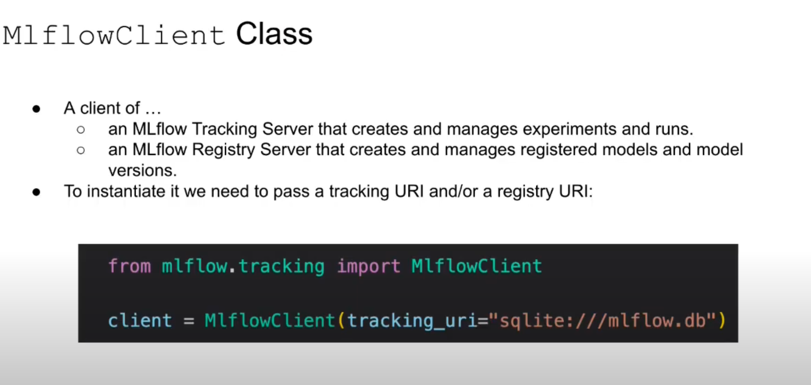
  The Python MlflowClient class enables:
  - Listing experiments and runs,
  - Filtering based on tags, stages, or metric thresholds,
  - Registering new model versions,
  - Transitioning model stages,
  - Annotating stage transitions with timestamps and rationale.

- 🧪 **Testing Models with Live Data**  
  The instructor demonstrates using March taxi data to test models:
  - A preprocessor is loaded from MLflow,
  - Models are fetched by stage ("Production" or "Staging"),
  - Predictions are generated and RMSE is computed for each,
  - Based on performance, the better model is promoted or retained.

- 📋 **Model Promotion Decision**  
  In the scenario, the production model performs better and is faster. Thus, the staging model is not promoted. This highlights how informed decisions can be made using structured metadata and evaluations.

- 🧠 **Lineage and Traceability**  
  Each model in MLflow's registry links to its experiment run, enabling users to:
  - Inspect training code and parameters,
  - Review environment dependencies,
  - Understand why and when changes were made,
  - Rollback confidently if issues arise in production.

- 🧩 **Full Lifecycle View**  
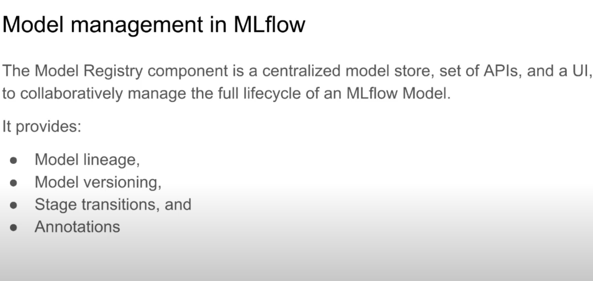
  The registry offers:
  - Automatic versioning,
  - Easy rollback,
  - Model lineage,
  - Seamless collaboration between data scientists and engineers,
  - APIs for integration with CI/CD pipelines and automated evaluation scripts.

# MLOps Zoomcamp 2.6 - MLflow in Practice

YouTube Link: [MLOps Zoomcamp 2.6 - MLflow in Practice](https://www.youtube.com/watch?v=1ykg4YmbFVA&list=PL3MmuxUbc_hIUISrluw_A7wDSmfOhErJK)

## Summary
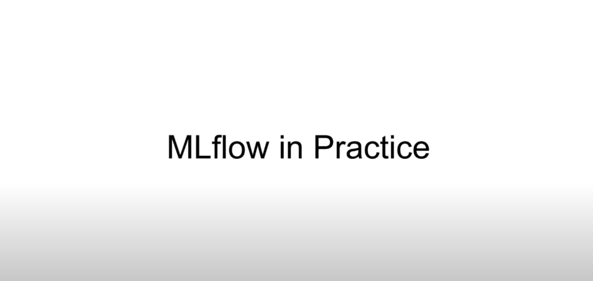

- 🎯 **Objective of the Video**  
  This session concludes the experiment tracking module by showing how to configure MLflow in different real-world situations—ranging from solo projects to collaborative enterprise environments.

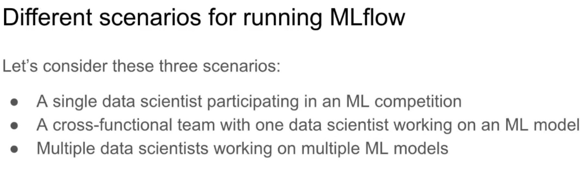
- 🧍‍♀️ **Scenario 1: Single Data Scientist (No Remote Setup)**  
  Ideal for ML competitions or solo projects. All runs, parameters, and models are stored locally:
  - No need for a tracking server.
  - The backend store and artifact store are directories on the local machine.
  - Simple mlruns folder structure holds all experiment data.
  - MLflow UI can still be used for exploration.

- 👥 **Scenario 2: Cross-Functional Team with One Data Scientist**  
  A single ML developer collaborates with other roles like product managers or backend engineers:
  - A local tracking server is launched using SQLite.
  - Artifact store is typically local but may be moved to the cloud for access.
  - The server enables others to view experiments and monitor training in real-time.
  - Model registry is enabled, and models can be versioned and promoted using the UI.

- 🤝 **Scenario 3: Fully Collaborative Team Setup**  
  Multiple data scientists work on several models:
  - Remote MLflow tracking server hosted on AWS EC2.
  - PostgreSQL used for the backend store via AWS RDS.
  - Artifacts stored in an AWS S3 bucket.
  - Tracking server is publicly accessible via port 5000, configured via security groups.
  - Every model's full lifecycle is managed and shared.

- 🔧 **Configuration Essentials**
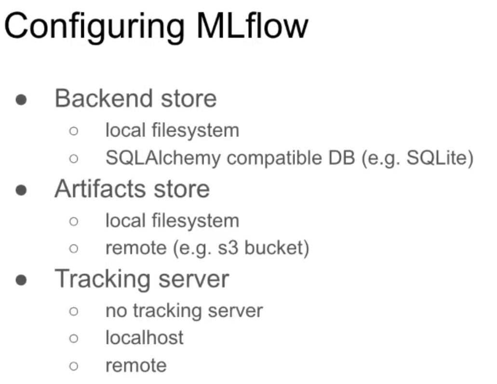
  MLflow's behavior is defined by:
  - Backend Store – Stores metadata (metrics, params) in SQLite or PostgreSQL.
  - Artifact Store – Stores files/models in local folders or cloud buckets (e.g., S3).
  - Tracking Server – Optional for solo use, but essential for sharing and model registry.

- 🧰 **Practical Demos**  
  Each scenario is demonstrated using notebooks and terminal commands:
  - MLflow UI is launched locally or remotely.
  - Models are trained, logged, and registered.
  - Artifacts are browsed both in file systems and S3.

- 🗂️ **Model Registry Features**  
  - Models can be registered via Python or the UI.
  - Each model is linked to the run that created it.
  - Metadata includes metrics, hyperparameters, size, and environment.
  - Models can be moved to different lifecycle stages: Staging, Production, Archived.

- ☁️ **Deploying MLflow on AWS**  
  Step-by-step guide for cloud setup includes:
  - Launching an EC2 instance,
  - Creating an S3 bucket and a PostgreSQL RDS instance,
  - Configuring the tracking server to use these resources,
  - Connecting locally with valid AWS credentials and security rules.

- 🔐 **Security and Permissions**  
  Proper configuration of IAM roles and security groups ensures:
  - EC2 instance can access S3 and RDS,
  - Local machines can access EC2-based tracking server,
  - Credentials are secured using environment variables or profiles.

- 📦 **Deployment and Collaboration Use Cases**  
  This setup supports:
  - Real-time experiment monitoring,
  - Centralized model versioning and metadata access,
  - Seamless collaboration between model creators and deployers.


# MLOps Zoomcamp 2.7 - MLflow: Benefits, Limitations, and Alternatives
YouTube Link: [MLOps Zoomcamp 2.7 - MLflow: Benefits, Limitations, and Alternatives](https://www.youtube.com/watch?v=Lugy1JPsBRY&list=PL3MmuxUbc_hIUISrluw_A7wDSmfOhErJK&index=14)

## Summary
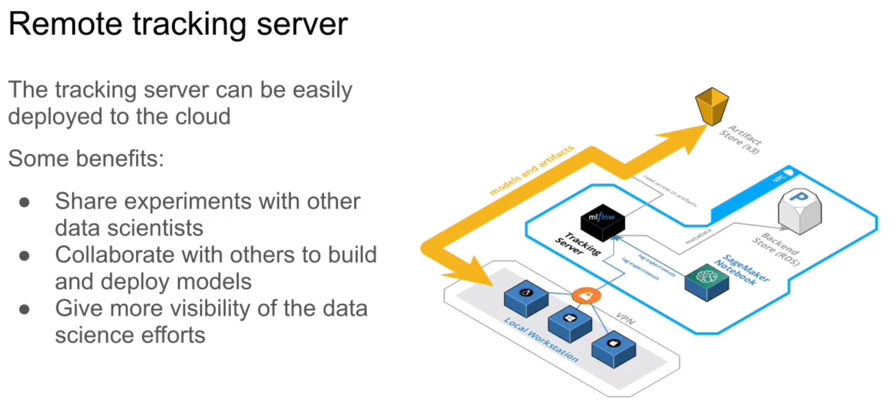

- ✅ **Why Use a Remote Tracking Server in MLflow**  
  A shared MLflow tracking server streamlines ML collaboration by allowing:
  - Multiple data scientists to access and continue experiment runs,
  - Teams to evaluate, promote, and deploy models collaboratively using a model registry,
  - Stakeholders such as PMs or business leaders to gain visibility into experiment progress and results.

- 🤝 **Enhancing Team Collaboration**  
  Through a shared remote server, a model's lifecycle—from training to deployment—can be coordinated between roles. Data scientists can register top-performing models, while ML engineers or SREs can retrieve and deploy them.

- 🧱 **Infrastructure Drawbacks**  
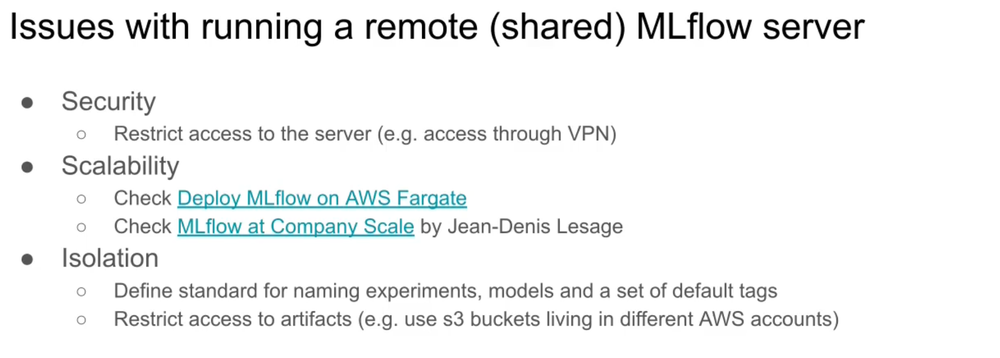
  Operating a shared MLflow server raises several concerns:
  - Security Risks: Without safeguards like a VPN, external actors could access sensitive runs or models.
  - Scalability: MLflow's basic deployment won't scale to thousands of experiments or users. Solutions include:
    - AWS Fargate-based scalable setups.
    - Enterprise-grade deployments like Criteo's implementation.
  - Lack of Experiment Isolation: Different teams using the same experiment or model names might cause unintentional overwrites.

- 🔐 **Best Practices for Isolation and Access Control**  
  To minimize conflicts and ensure governance:
  - Prefix experiment/model names with team identifiers.
  - Enforce tagging standards (e.g., user name, team, purpose).
  - Use separate S3 buckets or AWS accounts for artifact stores tied to team access permissions.

- 🚧 **MLflow's Current Limitations**  
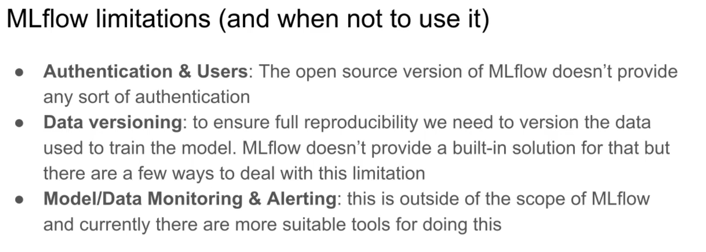
  - Authentication & Access Control: The open-source MLflow lacks native support for user identities and permissions.
    - Databricks' managed MLflow includes these features but requires a paid plan.
  - Data Versioning: No built-in way to track dataset versions.
    - Workarounds include logging file paths, hashes, or saving datasets as artifacts—inefficient but possible.
  - Model Monitoring: MLflow does not support real-time model behavior monitoring or alerting on drift or anomalies.
    - Some users log performance statistics to MLflow, but other tools are better suited.

- 🔁 **Alternatives to MLflow** 
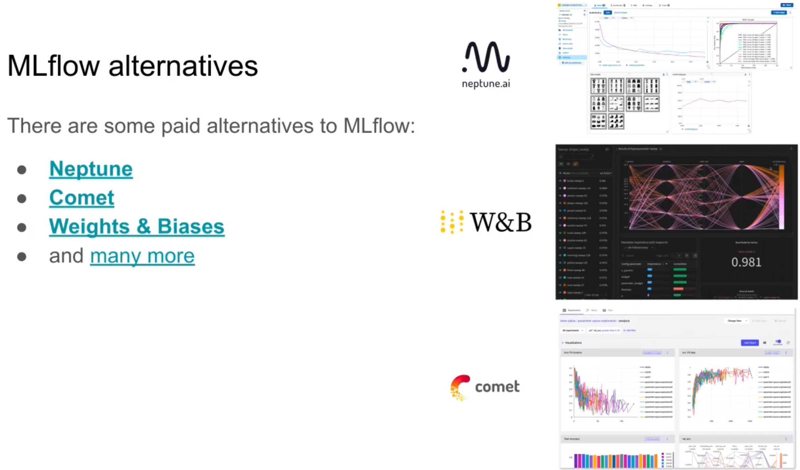
  Teams with more advanced or specialized needs might consider:
  - Neptune.ai
    - Focused on metadata and model registry.
    - Supports more integrations and CPU/memory tracking.
    - Strong support for teams and reproducibility.
  - Weights & Biases
    - Known for great experiment tracking and visualization.
    - No model registry but excels in dashboarding and comparisons.
  - Comet
    - Lightweight and similar to W&B but with fewer integrations.

- 📊 **Feature Comparison Insights**  
  The Neptune blog's tool comparison shows:
  - MLflow does not detect dirty commits, while others do.
  - MLflow integrates with most major ML libraries (e.g., PyTorch, XGBoost).
  - Alternatives offer extended integration with tools like Google Colab, TensorBoard, and more.

- 📦 **When to Use Which Tool**  
  - MLflow: Best for open-source flexibility, integration, or when using Databricks.
  - Neptune/W&B/Comet: Better for team collaboration, monitoring, user access, and richer visualization/reporting features.